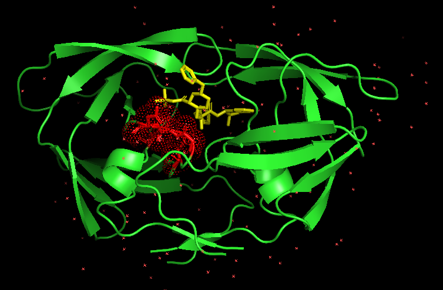

# Test

Para testear nuestro programa hemos decidido usar 3 proteínas diferentes. Nuestro approach de testeo ha sido el siguiente:
1) Usar proteínas con distinto tamaño.
2) Usar proteínas con distintos ligandos.
3) Usar proteínas de familias poco relacionadas.

Es por ello que nuestras proteínas escogidas son:

| PDB  | Protein Type          | Ligand Type                  | Size     |
|------|-----------------------|------------------------------|----------|
| 1HSG | Protease (homodimer)  | Small molecule inhibitor     | 200 aa  | 
| 4HHB | Transporter (tetramer)| Prosthetic group (heme)      | 574 aa  |
| 1ATP | Kinase (monomer)      | Nucleotide (ATP) + peptide   | 350 aa  | 

### `Test 1: 1HSG` 
1HSG es una enzima del virus del VIH que tiene función proteasa. Corta proteínas del virus para que estas puedan desempeñar su función correctamente. Es una de las proteínas más estudiadas y es bastante simple.

Como se puede ver en las imágenes comparativas, nuestro modelo es capaz de predecir el binding site de la proteína con exactitud. Eso sí, muchos de los aminoácidos que encuentra son falsos positivos.
Tabla 1: Comparativa
| Residue | Predicted | Real (BioLip) | Match |
|---------|-----------|---------------|-------|
| 8       | ❌        | ✅            | —     |
| 25      | ✅        | ✅            | ✓     |
| 27      | ✅        | ✅            | ✓     |
| 28      | ✅        | ✅            | ✓     |
| 29      | ✅        | ❌            | —     |
| 48      | ❌        | ✅            | —     |
| 49      | ❌        | ✅            | —     |
| 82      | ❌        | ✅            | —     |
| 84      | ✅        | ❌            | —     |

Tabla 2: Métricas
| Metric    | Value |
|-----------|-------|
| TP        | 3     |
| FP        | 2     |
| FN        | 4     |
| Precision | 60%   |
| Recall    | 43%   |
| F1 Score  | 50%   |

Imagenes comparativas: 
Figura 1: Predicción HSG1

Figura 2: Reales HSG1

#### Conclusion test 1:
El modelo es capaz de predecir bien el binding site pese a que deja mucho que desear en cuanto a predicción de los aminoácidos correctos.

### `Test 2: HBB4`

### `Test 3: 1ATP`

